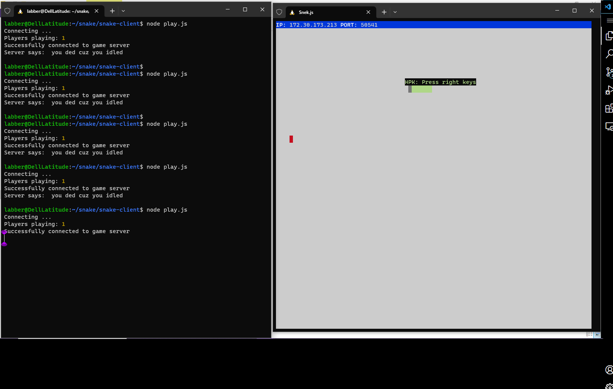
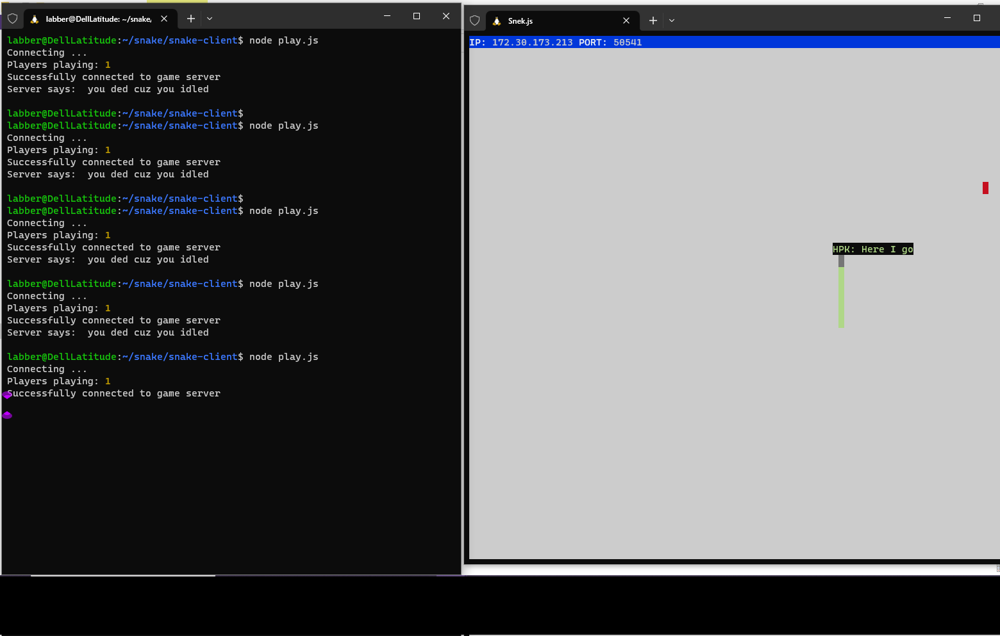

# Snake Client Project

I welcome you to reminisce childhood memories of playing snake games. 

It is a video game concept where the player maneuvers a dot and grows it by ‘eating’ pieces of food. As it moves and eats, it grows and the growing snake becomes an obstacle to smooth maneuvers. The goal is to grow it to become as big as possible without bumping into the side walls, or bumping into itself, upon which it dies. 

Please feel free to reach out me if you have any suggestions or would like to collaborate on such projects at haman42626@gmail.com

This project is made as a part of learning at Lighthouse Labs to solidy the concepts of TCP client-server connection and working with modules to make the code clean.

Before you can run this client, you will need to be running the server side which you can download and install from here. 
https://github.com/lighthouse-labs/snek-multiplayer

## What to Expect

## Instructions

- Follow steps inside the snek server repo to run the server side, use npm run play to run it.
- While the server is running, Run the development snake client using the `node play.js` command.
- Move the snake using W, A, S, D keys. 
- Use key "X" to say, "U r slow"
- Use key "Q" to say, "Here I go
- Don't you worry, if you press wrong key, there will be message to remind you to press the right keys.
- Make sure you don't get distracted while playing, otherwise the server will kick you out with a rude message.
- To exit the game, press Ctrl + C.

## Further Enhancements in progress

- Score: When snake eats food, score should increase by one. It should be displayed on the screen.
- Taking the name of users through Command Line Input.
- You can always see the count of how many players are playing at the moment on the terminal.
- Displaying the name of users playing and then removing it when a user has left.